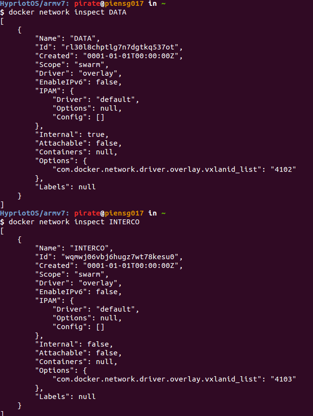

# Stack
Une stack doit être vu comme un manager de services qui permet de déployer une application dans un environnement spécifique. Elle permet donc d'orchestrer l'ensemble des services afin qu'ils communiquent ensemble.

> Note: Initialiser le [swarm](https://github.com/hbaltz/Projet-Raspberry-Docker/tree/master/Composants/Swarm) *(un manager / un worker)* avant de déployer la stack peut éviter certains problèmes.

## Configuration pour un redéploiement
### Récupération des images à déployer
Plusieurs solutions existent :
- cloner le dépôt git depuis un raspberry *(manager)* et aller dans le dossier Composants/Stack/prod/V2
```
    git clone https://github.com/hbaltz/Projet-Raspberry-Docker
    cd Projet-Raspberry-Docker/Composants/Stack/prod/V1
```
> Certaines images (traefik, httpd, rok4) se trouvent désormais dans le répertoire V2
> > La version V2 ajoute les configurations à ces images pour considérer traefik. Les migrations vers la V2 sont peu à peu résolues.
> Certaines images (networks) sont dans le répertoire Stack/test
- avoir les fichiers sur sa machine locale et les envoyer sur un raspberry *master* :
```
    scp docker-config-networks.yml piensg017:
    scp docker-config-traefix.yml piensg017:
    scp docker-config-registry.yml piensg017:
    scp docker-config-httpd.yml piensg017:
    scp docker-config-rok4.yml piensg017:
```

### Mise en place des réseaux :

Il est nécessaire de commencer par déployer les réseaux virtuels entre les composants.

###### NOT WORKING FOR NOW
En principe, une stack peut servir à configurer les networks. Malheureusement, nos tentatives sont restées infructueuses car la stack ne veut pas déployer de network sans déployer un service. Nous avons contourner ce problème par une [solution manuelle](#remove-following-section-when-working).

Pour cela, il suffit de déployer la stack networks comme suit :
```
docker stack deploy -c docker-config-networks.yml NETWORKS
```
> Attention, le nom de la stack est à respecter **obligatoirement** car toutes les autres stacks en dépendent.

[Quelques notes](https://github.com/hbaltz/Projet-Raspberry-Docker/blob/master/Composants/Stack/test/docker-networks-configuration.md) que nous avons écrites pour comprendre les liens entre les réseaux.

###### REMOVE FOLLOWING SECTION WHEN WORKING
D'après l'[article du blog Alex Ellis](http://blog.alexellis.io/docker-stacks-attachable-networks/), la ligne de commande suivante permet de créer un réseau attaché :
```
docker network create --driver=overlay --attachable core-infra
```

Pour faciliter nos tests (et par fainéantise), nous avons créer deux scripts qui permettent de :
- [déployer les réseaux](https://raw.githubusercontent.com/hbaltz/Projet-Raspberry-Docker/master/Composants/Stack/prod/start_stacks_networks.sh)
- [écraser les réseaux](https://raw.githubusercontent.com/hbaltz/Projet-Raspberry-Docker/master/Composants/Stack/prod/remove_stack_networks.sh)

Voici les deux réseaux ainsi créés :


###### REMOVE PRECEDENT SECTION WHEN WORKING

### Mise en place de la forge d'images (registry):
Le registry permet de stocker et distribuer les images Docker utilisées par notre stack.
```
docker stack deploy -c docker-config-registry.yml registry
```
> La stack registry se trouve dans le dossier Stack/prod/V1

Une fois le registry en place, il suffit d'y pousser l'ensemble des images nécessaires dans notre infrastructure. [Voir la documentation du registry.](../Registry/registry.md)


### Déployer les stacks (démarrage des services) :

> Les stacks doivent être démarrées sur un *master*.

Les stacks peuvent désormais être déployées avec la commande suivante :
```
docker stack deploy -c <docker config file (format .yml)> <stack tag>
```

    Exemple pour lancer traefik:
    > docker stack deploy -c docker-config-traefik traefik

Nous avons écrit un [script](https://github.com/hbaltz/Projet-Raspberry-Docker/blob/master/Composants/Stack/prod/start_stacks.sh) qui facilite le déploiement des différentes stacks, à condition que ce script soit executé dans le dossier contenant les fichiers de configuration .yml.

### Manipuler les stacks

#### Procédure d'arrêt des stacks
Pour arrêter une stack, il suffit d'exécuter la commande suivante :  
```
docker stack rm <stack tag>
```

> Note : Pour arrêter les networks, nous avions besoin de stopper les stacks les utilisant. C'est pourquoi le script de [révocation des réseaux](https://raw.githubusercontent.com/hbaltz/Projet-Raspberry-Docker/master/Composants/Stack/prod/remove_stack_networks.sh) arrête d'abord les stacks.

#### Procédure pour scaler un service :
Les stacks démarrent les services. Ceux-ci peuvent alors être scaler avec les commandes docker comme suit :
```
docker service scale SERVICE_NAME=NB_REPLICAs
```

#### Autres procédures
Voir [nos quelques notes](cmd.md) pour d'autres procédures.

## Récapitulatif :
```
# Stopper les anciennes stacks
    $ ./remove_stack_networks.sh
# Créer les réseaux
    $ ./start_stacks_networks.sh
# Déployer les stacks
    $ ./start_stacks.sh
```

## Perspectives :
- Les stacks pourraient être fusionnées dans un seul fichier de configuration. Seulement, pour des questions de développement en mode collaboratif, nous avons préféré les séparer dans plusieurs fichiers (atomicité) et utiliser des scripts bash pour manager les multiples commandes. Une tentative de fusion avec prise en charge des réseaux a été commencée [ici](https://github.com/hbaltz/Projet-Raspberry-Docker/blob/master/Composants/Stack/prod/NETWORKS_docker-config-influxdb.yml).

- De nouveaux outils pour faciliter la manipulation des stacks sont proposés par la communauté. Ils sont par ailleurs activement développé par celle-ci. L'un d'eux, [docker-cloud](https://docs.docker.com/docker-cloud/apps/stacks/), permet de disposer d'une interface web pour manager les stacks. Il dispose également d'une version en ligne de commande, qui permet entre autre de :
  - Scaler un service en cours d'exécution :
        docker-cloud service scale (uuid or name) 2
  - Mettre à jour une image d'un service en cours d'exécution :
        docker-cloud stack update -f docker-cloud.yml (uuid or name)

## Bibliographie

### Aide écriture d'un fichier yaml stack
[Stack yaml reference](https://docs.docker.com/docker-cloud/apps/stack-yaml-reference/)

### Deployer une stack  
[Stack deploy](https://docs.docker.com/engine/swarm/stack-deploy/)

### Exemple d'utilisation de swarm et stack à partir de docker-compose.yml  
[Using docker stack and compose yaml files to deploy swarm services](https://technologyconversations.com/2017/01/23/using-docker-stack-and-compose-yaml-files-to-deploy-swarm-services/)
